<!-- HEADER BANNER -->

 

<!-- CATCHPHRASE -->
### 🚀 Code Craftsman • 🧠 Problem Solver • 📊 Data Alchemist • 🌱 Lifelong Learner

 

<!-- SOCIAL BADGES -->

 

<!-- STREAK STATS -->

  

 

## 🔥 About Me

 
   

I am a **Full-Stack Architect** and **Data Scientist** on a mission to engineer the next generation of intelligent, scalable applications. With a dual focus on high-efficiency development and advanced data modeling, I transform complex challenges into elegant, performance-driven solutions. My work is anchored by a deep mastery of Data Structures and Algorithms, enabling me to architect systems that scale without compromise.

When I'm not orchestrating code, I'm usually:
- 🔭 **Contributing** to global open-source projects.
- 🏗️ **Deep-diving** into advanced system design.
- 🤖 **Pushing limits** with Generative AI and automation.
- 🚀 **Building** digital products that make an impact.

💡 **Philosophy:** *"Code should not only work but tell a story of efficient problem-solving."*

## 🛠️ Technology Arsenal

### 💻 Programming Languages

  

### 🎨 Frontend Development

  

### ⚙️ Backend Development

  

### 🗄️ Databases & ORMs

  

### 📊 Data Science & ML

  

### ☁️ Cloud & DevOps

  

## 🔄 Dev Workflow

```mermaid
graph LR
    A[Code] --> B[Git Push]
    B --> C[CI/CD Pipeline]
    C --> D[Docker Build]
    D --> E[Deploy to VPS]
    E --> F[Apache2 / Nginx]
    F --> G[Production 🚀]

    style A fill:#1a1a1a,stroke:#00FF9D,stroke-width:2px,color:#fff
    style B fill:#1a1a1a,stroke:#00FF9D,stroke-width:2px,color:#fff
    style C fill:#1a1a1a,stroke:#00FF9D,stroke-width:2px,color:#fff
    style D fill:#1a1a1a,stroke:#00FF9D,stroke-width:2px,color:#fff
    style E fill:#1a1a1a,stroke:#00FF9D,stroke-width:2px,color:#fff
    style F fill:#1a1a1a,stroke:#00FF9D,stroke-width:2px,color:#fff
    style G fill:#00FF9D,stroke:#00FF9D,stroke-width:2px,color:#000
```
 

## 🎯 Coding Profiles

  <h3>💪 Problem Solving Skills</h3>
  
  
  

## 📂 Featured Projects

### 🚀 Full-Stack Applications
| Project | Tech Stack | Description |
| :--- | :--- | :--- |
| **AetherCart** | React, Node.js, MongoDB, Redis | A lightning-fast e-commerce engine with real-time sync and modular architecture. |
| **TitanFlow AI** | Next.js, NestJS, PostgreSQL, Docker | Next-gen project orchestration with automated intelligence and deep-insights. |
| **Spectral Chat** | Socket.io, React, Express, MongoDB | Ultra-secure, low-latency communication suite with end-to-end encryption. |

### 📊 Data Science Projects
| Project | Tools | Description |
| :--- | :--- | :--- |
| **InsightFlow ML** | Python, Scikit-learn, Flask | High-precision predictive engine for enterprise-scale decision support. |
| **PersonaLens** | Pandas, K-means, Matplotlib | Deep behavioral analytics for multi-dimensional customer segmentation. |
| **FinPulse Dashboard** | Streamlit, yFinance, Plotly | Advanced quantitative analysis tool for real-time market sentiment and trends. |

## 📝 Latest Blog Posts
<!-- BLOG-POST-LIST:START -->
- [Microservices vs Monolith: Choosing the Right Architecture](#! )
- [Optimizing React Performance with Memoization](#! )
- [Building Scalable APIs with GraphQL](#! )
<!-- BLOG-POST-LIST:END -->

## 🤝 Let's Collaborate!
I'm always open to interesting projects and collaborations. Whether you want to:

*   🚀 Build a groundbreaking startup
*   🔍 Solve challenging technical problems
*   📚 Learn together about new technologies
*   💡 Discuss innovative ideas

📬 **Reach out:** [munnakumar6204835946@gmail.com](mailto:munnakumar6204835946@gmail.com)

 

  <h3>🌟 Support My Work</h3>
  If you find my projects helpful, consider giving them a star! ⭐

    

  

  **Made with ❤️ by Munna Kumar**

